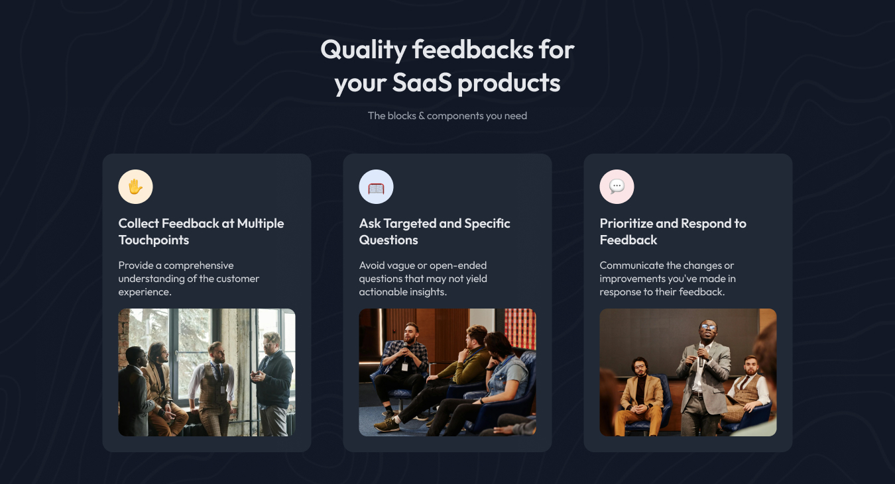
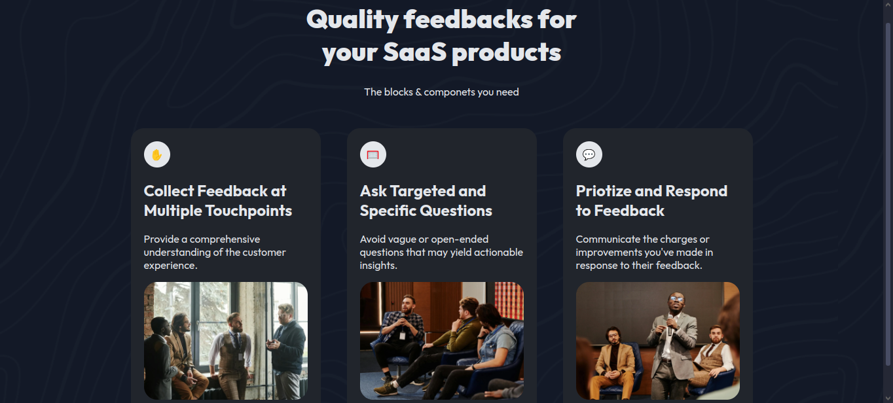

<!-- Please update value in the {}  -->

<h1 align="center">Simple Feature website | devChallenges</h1>

   Solution for a challenge <a href="https://devchallenges.io/challenge/join-our-newsletter" target="_blank">Join Our Newsletter</a> from <a href="http://devchallenges.io" target="_blank">devChallenges.io</a>.

  <h3>
    <a href="https://blacknate.github.io/Website-Portfolio/Simple-Feature-Section/">
      Demo
    </a>
     | 
    <a href="https://blacknate.github.io/Website-Portfolio/Simple-Feature-Section/">
      Solution
    </a>
     | 
    <a href="https://devchallenges.io/challenge/join-our-newsletter">
      Challenge
    </a>
  </h3>

<!-- TABLE OF CONTENTS -->

## Table of Contents

- [Overview](#overview)
  - [What I learned](#what-i-learned)
  - [Useful resources](#useful-resources)
- [Built with](#built-with)
- [Features](#features)
- [Acknowledgements](#acknowledgements)

<!-- OVERVIEW -->

## Overview

<!--My attempted site screenshot-->

<!--
Introduce your projects by taking a screenshot or a gif. Try to tell visitors a story about your project by answering:

- What have you learned/improved?
- Your wisdom? :)
-->
The Devchallenge was to copy as much as I can the given website that has three features. The should be responsive to screen which i managed to do using flexbox. I managed to get 84% closer to the given original site. 

### Built with

<!-- This section should list any major frameworks that you built your project using. Here are a few examples.-->

- Semantic HTML5 markup
- CSS custom properties
- Flexbox

## Features

<!-- List the features of your application or follow the template. Don't share the figma file here :) -->

This application/site was created as a submission to a [DevChallenges](https://devchallenges.io/challenges-dashboard) challenge.

## Author

- Website [https://github.com/blacknate/Website-Portfolio/](https://blacknate.github.io/Website-Portfolio/Simple-Feature-Section/)
- GitHub [@BlackNate](https://github.com/BlackNate)
