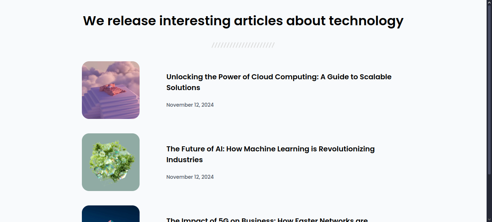

<!-- Please update value in the {}  -->

<h1 align="center">Simple Article Listing | devChallenges</h1>

   Solution for a challenge <a href="https://devchallenges.io/challenge/simple-article-listing" target="_blank">Simple Article Listing</a> from <a href="http://devchallenges.io" target="_blank">devChallenges.io</a>.

  <h3>
    <a href="https://blacknate.github.io/Website-Portfolio/DevChallenges-Projects/article-listing/">
      Demo
    </a>
     | 
    <a href="https://github.com/BlackNate/Website-Portfolio/tree/main/DevChallenges-Projects/article-listing">
      Solution
    </a>
     | 
    <a href="https://devchallenges.io/challenge/simple-article-listing">
      Challenge
    </a>
  </h3>

<!-- TABLE OF CONTENTS -->

## Table of Contents

- [Overview](#overview)
  - [What I learned](#what-i-learned)
- [Features](#features)
- [Built with](#built-with)
- [Contact](#contact)
- [Acknowledgements](#acknowledgements)

<!-- OVERVIEW -->

## Overview

This is a simple, responsive webpage that showcases a collection of blog articles about technology. It includes a clean and minimal design with HTML and CSS, featuring a structured layout for displaying article titles, images, and publication dates.

- What have you learned/improved?
    * I have learned more on how to make the site more resposive using media query compared to my previous projects.

### Features

- Responsive design for different screen sizes.
- Uses Google Fonts for typography.
- Displays article images, titles, and dates.
- Clean and structured layout using CSS Flexbox.

### Built with

- Semantic HTML5 markup
- CSS custom properties
- Flexbox
- CSS Grid
- Google Fonts (Poppins)

## Author

- Website [your-website.com](https://blacknate.github.io/Website-Portfolio/DevChallenges-Projects/article-listing/)
- GitHub [@your-username](https://blacknate.github.io/)
